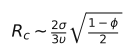
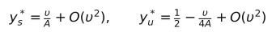
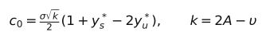
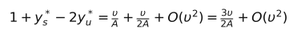
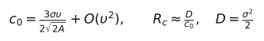
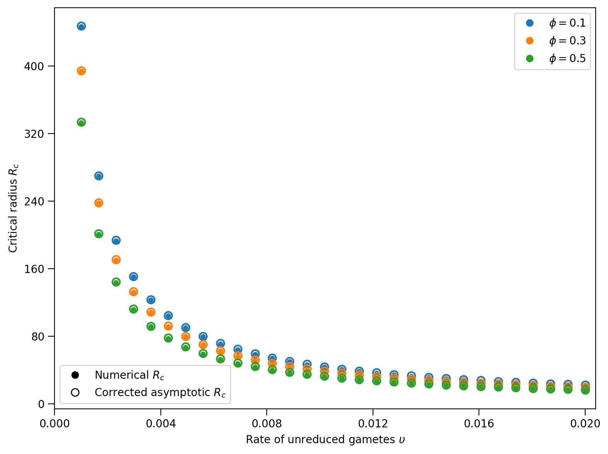
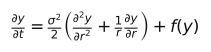
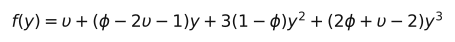

# Figure 3: numerical and corrected asymptotic critical radius

Numerical analysis accompanying *Spatial Establishment of Autotetraploid
Populations Follows the Propagation of Bistable Waves of Advance*,
[Bulletin of Mathematical Biology (2026), 88:139](https://doi.org/10.1007/s11538-026-01707-2).

## Correction to the asymptotic prefactor

**Equation (24) requires a prefactor of 2/3.** For fixed triploid contribution
φ and small unreduced-gamete production υ, the corrected leading-order result is



The linear dependence on dispersal scale σ, inverse dependence on υ, and
square-root dependence on 1 − φ are unchanged. The published expression is
3/2 times the corrected leading-order prediction: it requires an initial patch
radius 50% larger. It therefore imposes a more stringent establishment criterion
and predicts establishment for a smaller set of introductions. In this sense,
the published approximation is conservative about establishment capacity relative
to the approximation with the 2/3 prefactor. This comparison of the two formulas
does not establish a rigorous upper bound for the full radial PDE threshold.

### Why the factor appears

Write A = 1 − φ. Both the lower stable equilibrium and the unstable equilibrium
have first-order corrections:



The planar wave speed uses the following combination:





For simplicity, the published derivation approximates the unstable equilibrium
by its limiting value, 1/2. That limit is correct. However, the lower stable
equilibrium approaches zero and the unstable equilibrium approaches 1/2 at the
same asymptotic order: both deviations are O(υ), at fixed φ. Replacing the
unstable equilibrium by exactly 1/2 before expanding therefore discards a term
of the same order as the retained lower-equilibrium contribution. Because the
constant terms in the wave speed cancel, both first-order corrections must be
retained to obtain the leading coefficient. Doing so, and then using the radial
curvature approximation, gives



This is a leading-order, large-radius approximation, not an exact formula for
the invasion threshold of a finite top-hat introduction. Its asymptotic regime
is small υ/(1 − φ), with φ fixed.

## Corrected Figure 3



**Figure 3.** Critical introduction radius as a function of unreduced-gamete
production υ, for φ = 0.1, 0.3 and 0.5, with σ = 1. Filled circles are numerical
estimates from the radial PDE; open circles are the corrected leading-order
approximation. Numerical values were recomputed using the revised stopping
rule described below. The sweep contains 30 evenly spaced values of υ from
0.001 to 0.02 for each φ.

Downloads: [PDF](Figure3.pdf) · [SVG](Figure3.svg) · [numerical data (CSV)](Figure3_data.csv).

## Model and numerical method

The simulated radial reaction–diffusion equation is



with the reaction term



The initial condition is a top-hat patch: **y = 1 for r < R0, and y = 0
elsewhere**. The background subsequently relaxes to the lower stable equilibrium.
The numerical threshold refers to the initial patch radius R0.

Diffusion is implicit and reaction is explicit. The solver imposes radial
symmetry at the origin and zero flux at the outer boundary. The default grid
uses `dr = 0.10`, `dt = 0.10`, and a bisection tolerance of `0.10` radius units.
The domain radius is `max(250, R0 + 80)`; spatial resolution stays fixed across
the sweep.

### Correction to the stopping rule

The earlier implementation could classify a patch from the sign of its final
displacement relative to the requested radius. Since the initial top-hat is
rounded onto the grid, this could assign opposite outcomes to identical initial
states. Initial transients could also be mistaken for long-term expansion.

The revised implementation:

- Uses three successive 40-time-unit windows of measured front velocity after
  at least 60 time units of relaxation. Velocities must have the same sign,
  exceed the numerical tolerance, and no longer be rapidly decaying.
- Declares collapse if the entire state falls below the unstable equilibrium.
- Retains an unresolved outcome when the time budget expires; an unresolved
  classification stops the sweep instead of entering the bisection as a label.
- Searches the expansion/collapse boundary by bracketing and bisection.

The velocity rule is a numerical diagnostic, not a proof of the continuum
threshold. Grid, domain and integration-time checks remain necessary near the
boundary. See [VALIDATION.md](VALIDATION.md) for checks on the regenerated figure.

## Reproduce the figure

Requires Python 3.11 or newer, NumPy and Matplotlib. SciPy is recommended for
speed; a NumPy tridiagonal fallback is provided.

```bash
python NumericsAsymptoticsPolyploid.py --output Figure3.pdf --csv Figure3_data.csv
```

This writes PDF, PNG and SVG versions of the figure and the CSV table. Add
`--profile` for timing information.

```bash
python NumericsAsymptoticsPolyploid.py --self-test --convergence-check
```

For a quick, smaller sweep:

```bash
python NumericsAsymptoticsPolyploid.py --output test.pdf \
  --upsilon-min 0.015 --upsilon-max 0.02 --upsilon-count 3 --phis 0.1
```

## Equation display

Equations are embedded as local SVG images so that they remain readable in
GitHub and other Markdown viewers without relying on a particular math renderer.
Their editable mathematical source is in [render_readme_equations.py](render_readme_equations.py).
Regenerate them with:

```bash
python render_readme_equations.py
```
